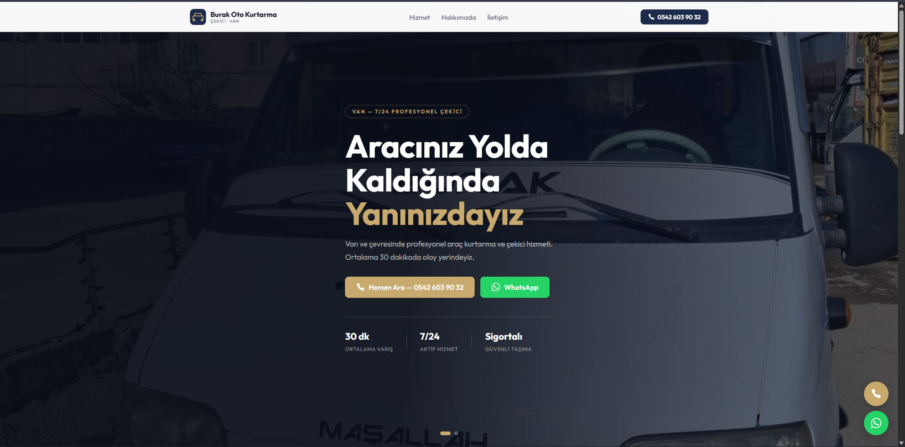
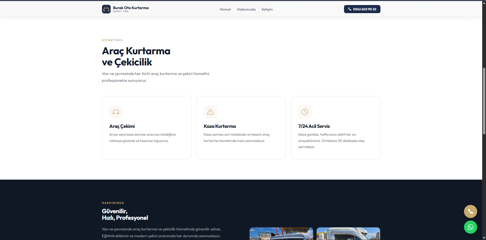
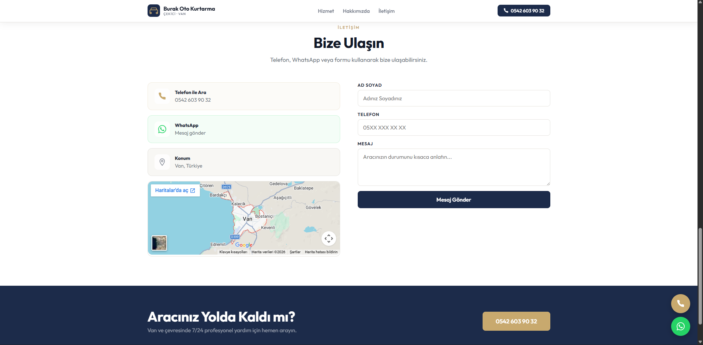

&#x20;Burak Oto Kurtarıcı

Burak Oto Kurtarıcı, yolda kalan araçlar için hızlı ve güvenilir oto kurtarma hizmeti sunmayı amaçlayan bir web projesidir.

\- Proje Hakkında

Bu proje, kullanıcıların ihtiyaç duydukları anda oto kurtarma hizmetine kolayca ulaşabilmelerini sağlamak amacıyla geliştirilmiştir. Basit, anlaşılır ve kullanıcı odaklı bir yapı hedeflenmiştir.

\- Özellikler

\* Araç kurtarma hizmeti tanıtımı

\* Hızlı iletişim imkanı

\* Kullanıcı dostu arayüz

\- Kullanılan Teknolojiler

\* HTML

\* CSS

\* JavaScript

\- Kurulum

Projeyi klonlamak için:

git clone https://github.com/Esmasyr/burak-oto-kurtarici.git

\-Lisans

Bu proje kişisel kullanım amacıyla geliştirilmiştir.

\- Ekran Görüntüleri

&#x20; 

&#x20; 

&#x20; 

